# py-claw

## 项目愿景

本仓库有两条并行主线：

1. `src/py_claw/` 是当前主运行时：一个正在成形的 Python 版 Claude Code 兼容实现，已覆盖控制协议、结构化 I/O、权限判定、设置加载、内置工具执行、hook 运行时、MCP 状态建模与 query runtime。
2. `ClaudeCode-main/` 是还原得到的 TypeScript 参考源码树，用来帮助对齐上游行为、命名、命令面和 Remote Control/CLI 架构，但不是本仓库的主执行入口。

整体目标不是做一个通用 Web 服务，而是做一个面向 Claude Code SDK/CLI 行为的本地运行时与协议兼容层，同时保留上游参考树作为导航镜像。

## 架构总览

- 根配置由 `pyproject.toml` 驱动，暴露 `py-claw` CLI 入口。
- 主 Python 包位于 `src/py_claw/`。
  - `cli/` 负责命令行入口、流式 JSON 控制循环、运行态封装。
  - `query/` 负责 turn 编排与后端适配。
  - `schemas/` 定义控制请求/响应、消息、Hook、权限结果等 Pydantic 模型。
  - `settings/` 负责加载、合并、校验 `.claude/settings*.json`。
  - `permissions/` 负责把设置源转成规则上下文，并做 allow/ask/deny 判定。
  - `tools/` 已实现内置工具注册、权限前置和本地执行。
  - `mcp/` 负责动态 MCP server 状态快照，不做真实连接。
  - `hooks/` 同时包含 hook schema 与命令 hook 执行器。
  - `services/remote/` 负责 CCR 远程会话管理（RemoteSessionManager、WebSocket、message_adapter、permission_bridge）。
- `tests/` 使用 pytest 覆盖 CLI、schema、权限、settings、tools、hooks、MCP 等核心行为。
- `ClaudeCode-main/` 提供上游还原参考，其中：
  - `src/cli/` 是结构化 I/O、remote I/O、transport 层
  - `src/bridge/` 是 Remote Control entitlement / session / REPL bridge 编排层
  - `src/commands/` 是 slash command 注册面与 feature gate 汇合点
  - `src/services/` 是模型请求、compact、MCP、LSP、OAuth、Session Memory、Agent 运行时服务层
  - `src/tools/` 是工具协议、工具装配与高阶工作流工具总线
  - `src/components/` 是基于 Ink 的终端 UI、dialog/design-system 与 agents 管理界面

当前扫描采用“高信号入口优先”策略：Python 主实现已接近完整的核心实现扫描；TypeScript 参考树已完成 `cli/bridge/commands/services/tools/components` 六个高价值子系统导航，并继续下钻了 `services/compact`、`services/mcp`、`services/api`、`services/SessionMemory`、`services/lsp`、`tools/BashTool`、`tools/AgentTool`、`tools/ToolSearchTool`、`tools/MCPTool`、`tools/SkillTool`、`components/agents`、`components/agents/new-agent-creation`、`components/design-system`、`components/CustomSelect`、`commands/plugin`、`bootstrap`、`entrypoints`、`skills`、`plugins`、`buddy`、`assistant`、`screens`、`state`、`utils` 等专题，但仍不是逐文件全量解构。

## 模块结构图

```mermaid
graph TD
    A["(根) py-claw"] --> B["src"];
    B --> C["py_claw"];
    C --> D["cli"];
    C --> E["query"];
    C --> F["schemas"];
    C --> G["settings"];
    C --> H["permissions"];
    C --> I["tools"];
    C --> J["mcp"];
    C --> K["hooks"];
    C --> U["ui"];
    C --> S["services"];
    S --> S1["api"];
    S --> S2["compact"];
    S --> S3["session_memory"];
    S --> S4["oauth"];
    S --> S5["lsp"];
    S --> S6["remote"];
    S --> S7["worktree"];
    U --> U1["screens"];
    U --> U2["widgets"];
    U --> U3["theme"];
    A --> L["tests"];
    A --> M["ClaudeCode-main"];
    M --> M1["src/cli"];
    M --> M2["src/bridge"];
    M --> M3["src/commands"];
    M --> M4["src/services"];
    M --> M5["src/tools"];
    M --> M6["src/components"];
    M --> M7["src/bootstrap"];
    M --> M8["src/entrypoints"];
    M --> M9["src/skills"];
    M --> M10["src/plugins"];
    M --> M11["src/buddy"];
    M --> M12["src/assistant"];
    M --> M13["src/screens"];
    M --> M14["src/state"];
    M --> M15["src/utils"];
    M --> N["shims"];
    N --> O["ant-claude-for-chrome-mcp"];
    N --> P["ant-computer-use-input"];
    N --> Q["ant-computer-use-mcp"];
    N --> R["ant-computer-use-swift"];
    N --> S["color-diff-napi"];
    N --> T["modifiers-napi"];
    N --> U["url-handler-napi"];
    M --> V["xiaohongshu"];

    click A "./CLAUDE.md" "查看根文档"
    click B "./src/CLAUDE.md" "查看 src 文档"
    click C "./src/py_claw/CLAUDE.md" "查看 py_claw 文档"
    click D "./src/py_claw/cli/CLAUDE.md" "查看 cli 模块文档"
    click E "./src/py_claw/query/CLAUDE.md" "查看 query 模块文档"
    click F "./src/py_claw/schemas/CLAUDE.md" "查看 schemas 模块文档"
    click G "./src/py_claw/settings/CLAUDE.md" "查看 settings 模块文档"
    click H "./src/py_claw/permissions/CLAUDE.md" "查看 permissions 模块文档"
    click I "./src/py_claw/tools/CLAUDE.md" "查看 tools 模块文档"
    click J "./src/py_claw/mcp/CLAUDE.md" "查看 mcp 模块文档"
    click K "./src/py_claw/hooks/CLAUDE.md" "查看 hooks 模块文档"
    click U "./src/py_claw/ui/CLAUDE.md" "查看 ui 模块文档"
    click S "./src/py_claw/services/CLAUDE.md" "查看 services 模块文档"
    click S5 "./src/py_claw/services/lsp/CLAUDE.md" "查看 lsp 服务文档"
    click S7 "./src/py_claw/services/worktree/__init__.py" "查看 worktree 模块文档"
    click L "./tests/CLAUDE.md" "查看 tests 文档"
    click M "./ClaudeCode-main/CLAUDE.md" "查看 TypeScript 参考树文档"
    click M1 "./ClaudeCode-main/src/cli/CLAUDE.md" "查看 cli 子系统文档"
    click M2 "./ClaudeCode-main/src/bridge/CLAUDE.md" "查看 bridge 子系统文档"
    click M3 "./ClaudeCode-main/src/commands/CLAUDE.md" "查看 commands 子系统文档"
    click M4 "./ClaudeCode-main/src/services/CLAUDE.md" "查看 services 子系统文档"
    click M5 "./ClaudeCode-main/src/tools/CLAUDE.md" "查看 tools 子系统文档"
    click M6 "./ClaudeCode-main/src/components/CLAUDE.md" "查看 components 子系统文档"
    click M7 "./ClaudeCode-main/src/bootstrap/CLAUDE.md" "查看 bootstrap 子系统文档"
    click M8 "./ClaudeCode-main/src/entrypoints/CLAUDE.md" "查看 entrypoints 子系统文档"
    click M9 "./ClaudeCode-main/src/skills/CLAUDE.md" "查看 skills 子系统文档"
    click M10 "./ClaudeCode-main/src/plugins/CLAUDE.md" "查看 plugins 子系统文档"
    click M11 "./ClaudeCode-main/src/buddy/CLAUDE.md" "查看 buddy 子系统文档"
    click M12 "./ClaudeCode-main/src/assistant/CLAUDE.md" "查看 assistant 子系统文档"
    click M13 "./ClaudeCode-main/src/screens/CLAUDE.md" "查看 screens 子系统文档"
    click M14 "./ClaudeCode-main/src/state/CLAUDE.md" "查看 state 子系统文档"
    click M15 "./ClaudeCode-main/src/utils/CLAUDE.md" "查看 utils 子系统文档"
    click N "./ClaudeCode-main/shims/CLAUDE.md" "查看 shims 文档"
    click O "./ClaudeCode-main/shims/ant-claude-for-chrome-mcp/CLAUDE.md" "查看模块文档"
    click P "./ClaudeCode-main/shims/ant-computer-use-input/CLAUDE.md" "查看模块文档"
    click Q "./ClaudeCode-main/shims/ant-computer-use-mcp/CLAUDE.md" "查看模块文档"
    click R "./ClaudeCode-main/shims/ant-computer-use-swift/CLAUDE.md" "查看模块文档"
    click S "./ClaudeCode-main/shims/color-diff-napi/CLAUDE.md" "查看模块文档"
    click T "./ClaudeCode-main/shims/modifiers-napi/CLAUDE.md" "查看模块文档"
    click U "./ClaudeCode-main/shims/url-handler-napi/CLAUDE.md" "查看模块文档"
    click V "./ClaudeCode-main/xiaohongshu/CLAUDE.md" "查看模块文档"
```

## 模块索引

| 模块 | 语言 | 入口/接口 | 测试 | 配置 | 覆盖摘要 | 一句话职责 |
|---|---|---|---|---|---|---|
| `src` | Python | `src/py_claw/cli/main.py` | `tests/` | `pyproject.toml` | Python 主实现高信号已补齐 | Python 源码总入口目录 |
| `src/py_claw` | Python | `cli/main.py`, `tools/runtime.py` | `tests/test_*.py` | `pyproject.toml` | 核心运行时已深扫 | Python 版 Claude Code 运行时主体 |
| `src/py_claw/cli` | Python | `main.py`, `control.py` | 根测试覆盖 | 根配置复用 | 4/5 | CLI、控制请求分发、结构化流输入输出 |
| `src/py_claw/query` | Python | `backend.py`, `engine.py` | 根测试覆盖 | 根配置复用 | 1/2 | Query runtime 层与后端适配 |
| `src/py_claw/schemas` | Python | `control.py`, `common.py` | 根测试覆盖 | 无独立配置 | 2/3 | 统一定义控制协议与消息模型 |
| `src/py_claw/settings` | Python | `loader.py`, `validation.py` | 根测试覆盖 | `.claude/settings*.json` | 4/5 | 设置加载、校验、深合并 |
| `src/py_claw/permissions` | Python | `engine.py`, `state.py`, `rules.py` | 根测试覆盖 | 权限规则来自 settings | 3/4 | 权限上下文构建与 allow/ask/deny 判定 |
| `src/py_claw/tools` | Python | `runtime.py`, `local_fs.py`, `local_shell.py` | `tests/test_tools_runtime.py` | 无独立配置 | 4/4 | 内置工具注册、权限前置与本地执行（含 LSPTool） |
| `src/py_claw/mcp` | Python | `runtime.py` | `tests/test_mcp_runtime.py` | settings 的 `mcp` 段 | 大部分完成 | MCP server 状态快照、stdio/SSE/WebSocket transport |
| `src/py_claw/services` | Python | 各子模块 | 各子模块测试 | 各子模块配置 | 基本完成 | 运行时服务层（auth/api/log/debug/stats/bash/session_state/cron/cleanup/suggestions/compact/session_memory/oauth/lsp/agent/ide/doctor/model/permissions/telemetry/sandbox/secure_storage/deep_link/file_persistence/native_installer/powershell/remote/worktree） |
| `src/py_claw/hooks` | Python | `schemas.py`, `runtime.py` | `tests/test_hooks_runtime.py` | settings 的 `hooks` 段 | 2/2 | Hook schema 与命令 hook 运行时 |
| `src/py_claw/ui` | Python | `textual_app.py` | `tests/test_tui*/**`, `tests/test_tui_textual.py` | textual>=0.50 | ✅ Phase 1-5 完成 + compact layout + shortcut surface | Textual 终端 UI 层（REPL 屏幕、overlay/dialog、设计系统组件） |
| `src/py_claw/ssh` | Python | `session.py` | 无独立测试 | 无独立配置 | 1/1 | SSH 会话管理 |
| `src/py_claw/buddy` | Python | `companion.py`, `sprites.py`, `prompt.py` | 无独立测试 | 无独立配置 | 3/3 | Companion sprite 系统、确定性roll、ASCII渲染 |
| `tests` | Python | `pytest` | 自身 | `tool.pytest.ini_options` | 6/6 | 协议与运行时行为回归 |
| `ClaudeCode-main` | TypeScript/Bun | `src/dev-entry.ts` | 未系统扫描 | `package.json`, `tsconfig.json` | 已补 `cli/bridge/commands/services/tools/components` 子系统 | 上游还原参考树 |
| `ClaudeCode-main/src/cli` | TypeScript | `structuredIO.ts`, `remoteIO.ts` | 未见独立测试结论 | transport/env flags | 子系统级已扫 | 协议 I/O、远程 transport、worker 状态同步 |
| `ClaudeCode-main/src/bridge` | TypeScript | `bridgeEnabled.ts`, `initReplBridge.ts` | 未见独立测试结论 | feature gates + OAuth + policy | 子系统级已扫 | Remote Control entitlement 与 session/bridge 编排 |
| `ClaudeCode-main/src/commands` | TypeScript | `commands.ts`, `types/command.ts` | 未逐命令扫描 | feature flags / auth availability | 子系统级已扫 | slash command 注册面与命令类型系统 |
| `ClaudeCode-main/src/services` | TypeScript | `api/claude.ts`, `mcp/client.ts` | 未见系统测试结论 | feature/env/growthbook/oauth | 已下钻到 `compact`、`mcp`、`api`、`SessionMemory`、`lsp` | 运行时服务层 |
| `ClaudeCode-main/src/tools` | TypeScript | `Tool.ts`, `tools.ts` | 未见系统测试结论 | permission/mode/feature flags | 已下钻到 `BashTool`、`AgentTool`、`ToolSearchTool`、`MCPTool`、`SkillTool` | 工具协议与工作流总线 |
| `ClaudeCode-main/src/components` | TypeScript/TSX | `App.tsx`, `FullscreenLayout.tsx` | 未见系统测试结论 | Ink/theme/modal context | 已下钻到 `agents`、`design-system`、`CustomSelect` | 终端 UI 层 |
| `ClaudeCode-main/src/bootstrap` | TypeScript | `state.ts` | 未见独立测试结论 | global state | 已建专题 | 全局状态中枢 |
| `ClaudeCode-main/src/entrypoints` | TypeScript | `cli.tsx`, `init.ts`, `mcp.ts` | 未见独立测试结论 | feature/env/bootstrap | 已建专题 | 启动入口层 |
| `ClaudeCode-main/src/skills` | TypeScript | `loadSkillsDir.ts`, `bundledSkills.ts` | 未见独立测试结论 | skills/commands settings | 已建专题 | skill 装载与注册层 |
| `ClaudeCode-main/src/plugins` | TypeScript | `builtinPlugins.ts` | 未见独立测试结论 | enabledPlugins | 已建专题 | builtin plugin 注册层 |
| `ClaudeCode-main/src/buddy` | TypeScript | `companion.ts`, `CompanionSprite.tsx` | 未见独立测试结论 | BUDDY feature | 已建专题 | companion/buddy 子系统 |
| `ClaudeCode-main/src/assistant` | TypeScript | `sessionDiscovery.ts` | 未见独立测试结论 | assistant mode | 已建专题 | assistant 会话辅助层 |
| `ClaudeCode-main/src/screens` | TypeScript/TSX | `Doctor.tsx`, `REPL.tsx` | 未见独立测试结论 | Ink/fullscreen | 已建专题 | 全屏屏幕层 |
| `ClaudeCode-main/src/state` | TypeScript/TSX | `AppState.tsx` | 未见独立测试结论 | React store | 已建专题 | 共享应用状态层 |
| `ClaudeCode-main/src/utils` | TypeScript | 大量工具函数 | 未见独立测试结论 | env/feature gate | 已建专题 | 通用辅助层 |
| `ClaudeCode-main/shims` | TypeScript | 各 `index.ts` | 未见测试 | 各子包 `package.json` | 7/7 包清单已扫 | 原生/桥接相关 shim 包集合 |
| `ClaudeCode-main/xiaohongshu` | TypeScript | 未深扫源码 | 未见测试 | `package.json` | 1/1 包清单已扫 | 独立辅助 Node 包 |

## 运行与开发

### Python 主实现

- 安装开发依赖：`pip install -e .[dev]`
- 查看版本：`py-claw --version`
- 直接运行：`python -m py_claw.cli.main --version`
- 运行测试：`pytest`

### TypeScript 参考树

仅在需要对齐上游参考时进入 `ClaudeCode-main/`：

- 安装依赖：`bun install`
- 启动开发入口：`bun run dev`
- 查看版本：`bun run version`
- **功能缺口分析**：`ClaudeCode-main/GAP_ANALYSIS.md`（TS 有 Python 暂无的完整清单）

## 测试策略

当前测试明显偏向“协议兼容”和“规则语义”而不是端到端交互：

- CLI 参数组合校验
- `stream-json` 控制请求/响应
- `StructuredIO` 缓冲、重放、关闭、异常路径
- Settings 来源优先级与合并结果
- Permission rule 解析、顺序、模式覆盖、MCP 规则与 glob 规则
- 内置工具注册与执行
- Hook 生命周期与权限请求链
- MCP 动态 server 状态返回

缺口主要是：

- 没有真实 MCP 连接测试
- 没有针对 `ClaudeCode-main` 参考树的对齐测试
- TypeScript 参考树仍有大量 P2/P3 区域未做逐文件扫描

## 编码规范

从现有实现可归纳出以下约束：

- Python 端优先使用 `from __future__ import annotations`
- 模型层使用 Pydantic v2，并保留上游 JSON 字段别名
- 轻状态对象偏好 `@dataclass(slots=True)`
- 权限判定先 `deny`，再 `ask`，再模式短路，再 `allow`
- settings 通过深合并叠加来源，不做扁平覆盖
- SDK/控制协议字段命名优先遵循上游 camelCase，Python 内部再做类型封装

## AI 使用指引

- 修改 Python 主实现时，优先保持与 `ClaudeCode-main` 的协议形状一致。
- 若改动 `schemas/`、`settings/`、`permissions/`、`tools/`、`hooks/` 或 `query/`，通常应同步补测试。
- `ClaudeCode-main/` 在本仓库里是参考镜像，不要把它误当作当前交付主代码。
- 扫描大目录时优先看入口、协议、配置、feature gate 与测试，不要先陷入大体量实现细节。
- 下一轮续扫建议优先从 `src/commands/install.tsx`、`src/services/lsp` 的 plugin 对接与 diagnostics 投递链，以及 `ClaudeCode-main/src/tools/SkillTool` 的邻接链（`src/commands.ts`、`processSlashCommand`、`services/skillSearch/*`）继续下钻，随后补 Python 的边缘导出文件与 TypeScript 测试布局。

## 变更记录 (Changelog)

- 2026-04-16：主交互快捷键面补齐完成 — 统一 `services/keybindings/service.py` 的 shortcut source，help menu / status line / footer 不再各自漂移；新增 `PromptInput` `Shift+Tab` mode cycle，并补 `tests/test_tui/test_prompt_input.py`、`tests/test_tui/test_repl_screen.py`、`tests/test_tui/test_overlays.py` 回归覆盖（52 个测试通过）
- 2026-04-16：窄屏 / 矮屏布局策略优化完成 — `textual_app.py` 不再在 `<80` / `<20` 时直接隐藏 `#pi-mode-bar` / `#repl-footer`；`REPLScreen` 统一分发 compact layout；`PromptInput` / `PromptFooter` 新增 `compact_mode` 并保留最小 mode/hint/suggestion/help 反馈；新增 responsive TUI 回归覆盖并刷新 `todo.md` 与 UI 文档
- 2026-04-16：主 REPL overlay 覆盖面补齐 — 新增 `tests/test_tui/test_overlays.py`（18 个测试通过），覆盖 Help / History Search / Quick Open / Model Picker / TasksPanel 的打开、关闭、互斥与选择结果回填；补 `PromptDialog` / `PermissionDialog` 最小交互验证；同步刷新 `todo.md`、根 `CLAUDE.md` 与 `src/py_claw/ui/CLAUDE.md`
- 2026-04-16：Prompt suggestion UX 收敛完成 — `PromptInput` 移除重复建议渲染，改由 `PromptFooter` 单一展示；`get_suggestions()` 补全 `AGENT`/`CHANNEL` 类型；`detect_type()` 修复 bare `#` 检测；PageUp 行为统一；新增 `tests/test_typeahead.py`（42 测试）
- 2026-04-15：补齐 `services/bridge/poll_config.py` 的动态配置接入，bridge poll config 现已通过 analytics dynamic config 读取 `tengu_bridge_poll_interval_config`，不再始终回退默认值；对应测试已补齐。
- 2026-04-15：继续深化轻量 handler，实现 `/remote-setup`（remote managed settings 状态/清缓存）、`/debug-tool-call`（diagnostic tracking 摘要）、`/issue`（gh CLI 只读 issue list/show）；同时完成新一轮递归对齐复扫，确认当前仅剩 `services/bridge/poll_config.py` 未接入真实 GrowthBook 刷新值这一项明确 runtime 缺口。
- 2026-04-15：继续深化 `/install` 命令，接入 native installer service 与全局配置持久化；现支持真实安装状态查看、stable/latest 安装流程与 update channel 记录，并补充命令回归测试。
- 2026-04-15：补齐低优先级命令对齐（issue/debug-tool-call/perf-issue/mock-limits/oauth-refresh/remote-setup/thinkback-play/bridge-kick/agents-platform/ant-trace/ctx_viz）、增强 FileEditTool、补齐 claudeApi/claude-api/claudeInChrome bundled skills，并刷新 todo.md / CLAUDE.md 进度文档。
- 2026-04-15：Agent Worktree 管理模块已完成。新增 `services/worktree/` 模块，实现 createAgentWorktree/removeAgentWorktree/cleanupStaleAgentWorktrees，包含 ephemeral slug 模式匹配和 stale worktree 清理功能
- 2026-04-14：P0 Remote 远程会话管理模块已完成（RemoteSessionManager、SessionsWebSocket、message_adapter、permission_bridge）。更新 todo.md 和 CLAUDE.md 文档。
- 2026-04-14：U1-U10 Utils 功能已完成（auth/api/log/debug/stats/bash/session_state/cron/cleanup/suggestions）。新增 10 个 services 子模块。
- 2026-04-14：U11-U20 Utils 功能已完成（model/permissions/telemetry/sandbox/secure_storage/deep_link/file_persistence/native_installer/powershell）。新增 9 个 services 子模块。
- 2026-04-14：S7-S23 Bridge 补充文件已完成（peer_sessions、poll_config、flush_gate、capacity_wake、debug_utils、work_secret、session_id_compat、bridge_pointer、bridge_status_util、repl_bridge_handle、repl_bridge_transport、inbound_messages、inbound_attachments、env_less_bridge_config）。Bridge 34/34 文件全部完成！
- 2026-04-13：M8 Doctor 服务已完成（系统诊断/安装检查/上下文警告），35 个测试全部通过。
- 2026-04-13：M5 IDE 服务已完成（IDE 检测/lockfile 管理/连接功能），37 个测试全部通过。
- 2026-04-13：M1 Agents 服务已完成（transcript/tracing/hooks/skill_preload/remote_backend），107 个测试全部通过。更新 todo.md 和 CLAUDE.md 文档。
- 2026-04-12：补全 `services/` 子模块索引（LSP/lsp_tool.py、oauth、compact、session_memory、api），更新根级模块结构图，纳入 services 导航链。
- 2026-04-11：扩展根级索引，纳入 TypeScript `assistant`、`screens`、`state`、`utils` 以及 Python `query` 新专题，并刷新下一轮续扫优先级。
- 2026-04-08：扩展根级索引，纳入 TypeScript `services/api`、`services/SessionMemory`、`services/lsp`、`tools/ToolSearchTool`、`tools/MCPTool`、`tools/SkillTool`、`components/CustomSelect`、`components/agents/new-agent-creation`、`commands/plugin` 等新增专题，并刷新下一轮续扫优先级。
- 2026-04-08：扩展根级索引，纳入 TypeScript `services/tools/components` 三大子系统及其六个深层主题导航。
- 2026-04-08：更新根级架构索引；补齐 Python tools/hooks/mcp/tests 事实，新增 TypeScript `cli/bridge/commands` 子系统导航。
